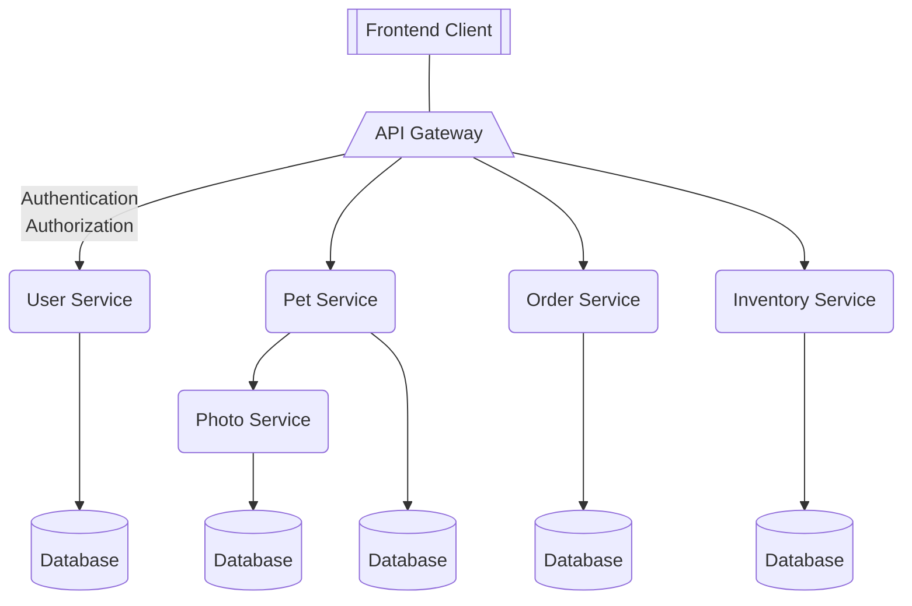
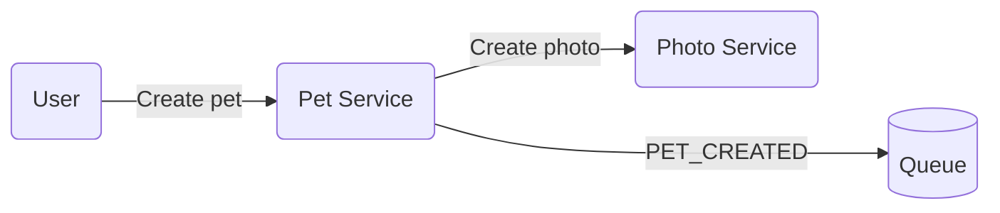
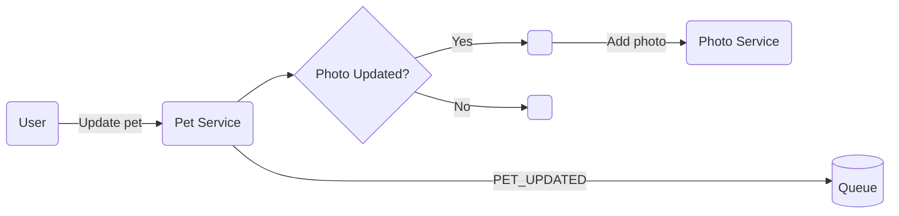
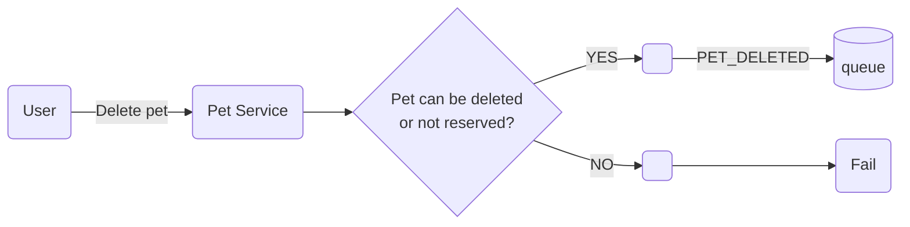
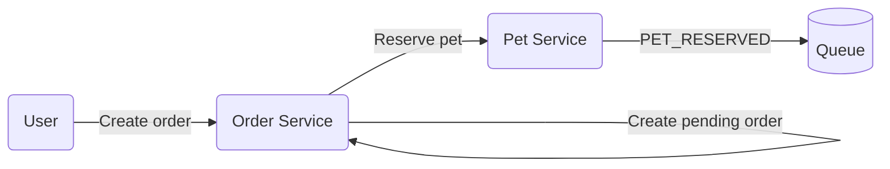
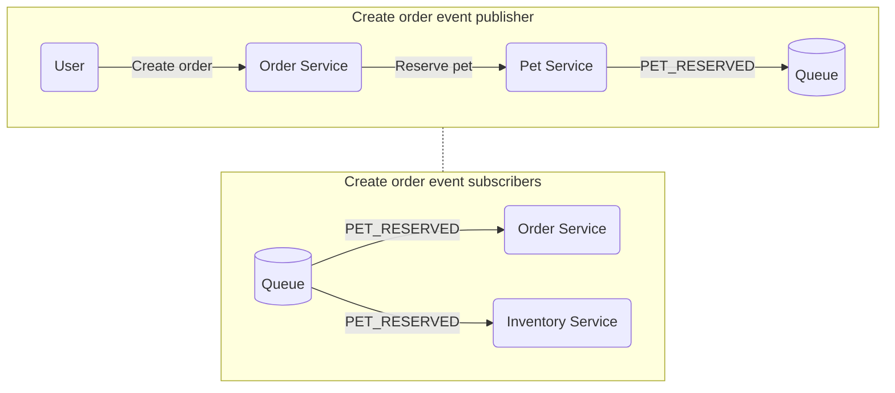
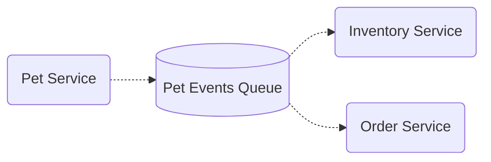
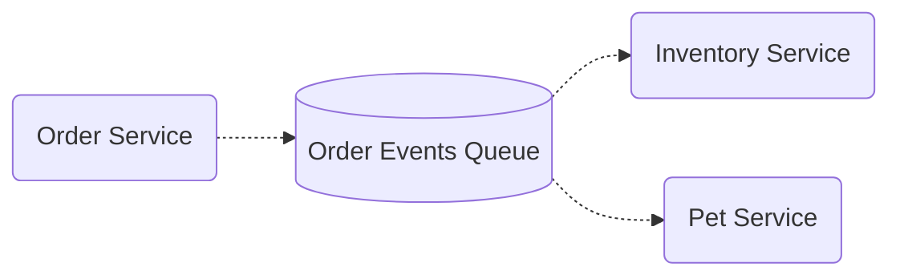
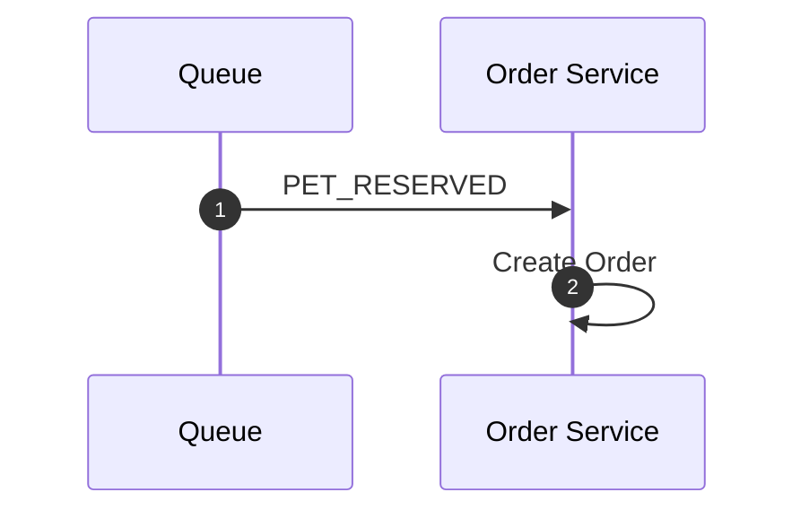
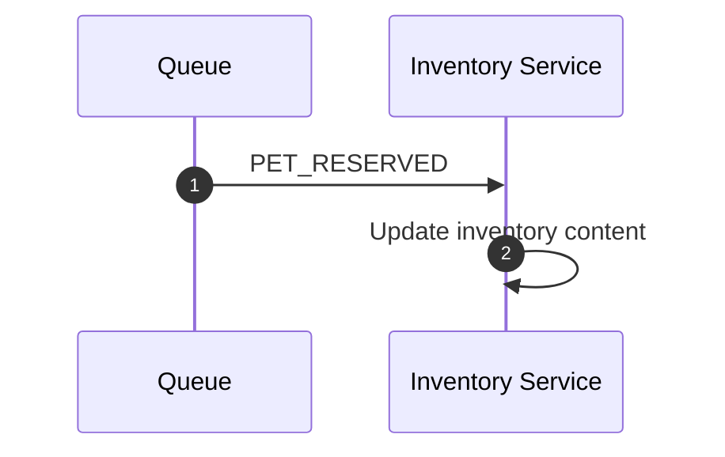

# Introduction

This service demonstrates common patterns in microservices:
- Synchronous communication using REST
- Async communication using pub/sub

# Design

The design is based on the famous **petstore** example for [OpenAPI spec](https://petstore.swagger.io/#/). The simple structure looks like this:

The implementation won't cover the **Frontend Client**. Also this high level schema only shows the sync communication between the services.

## Pet Lifecycle
### Create Pet

### Update Pet

### Delete Pet

What if there is an order that is already completed? A single sync check won't work because the order can be completed right after we check whether this pet can be deleted, thus the pet that belongs to a completed order will be deleted. To control it, pet service can't delete "reserved" pets. 

## Order Lifecycle
### Create Order

- User tries to create an order.
- Order service tries to reserve the pet, it is possible that multiple clients requested to order the same pet before the pet status is updated (in a small time window).
- Pet service atomically (db locks / transaction) reserves the pet for a single order and rest of the reserve requests will return an error.
  - Note that this is a business decision. The goal is selling a pet to only one customer, so there is only a single order. Instead we could have allowed multiple orders to reserve the pet and some decision maker to approve one of those orders and reject the rest.
- Inventory service removes the pet from inventory.
- If reservation failed, the order creation will halt and the user will get an error during order creation. If not, the order will be created as "placed".

Currently there is no flow where order state changes from **placed** to **approved** or **completed**. But we can assume there is an endpoint that allows store owner to change the status of the order. The flow can be as the following:
- Store owner approves the order.
- Pet service updates the pet status to be sold.
- Order service updates the order status to be approved/completed.

The creation operation seems simple and might not require async communication. We are making some assumptions while designing those endpoints. Let's consider the cases where failure can happen:
- After order service reserves the pet, what if inventory service is not reachable?
  - The application code should not fail because we assume inventory service do not carry any logic and this error is transient. But the state of the inventory will be broken if the communication is synchronous. If we use message queues to update the inventory, the message will wait until inventory service is reachable and functioning again.
- After the pet is reserved, what if the container died / some error is thrown before the order is created?
  - The pet will stay reserved and no order will be associated with it. This will result in the pet being not orderable indefinetly. So instead we can use async messaging to create an order. After the pet is reserved, it can emit a PET_RESERVED event and the order service can subscribe to it. The order will be created after the PET_RESERVED event is read.

# Events

And also schema for order events queue

## PET_RESERVED - Order Service

## PET_RESERVED - Inventory Service

